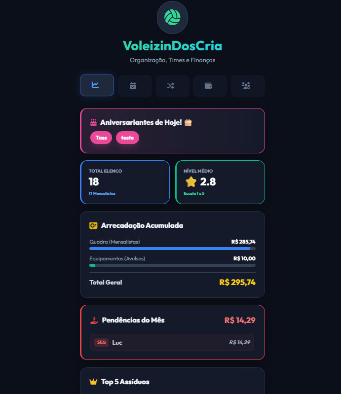

# <p align="center">🏐 VoleizinDosCria</p>

<p align="center">
  
  
  
  
  
</p>

<p align="center">
  <strong>O sistema definitivo para gestão de grupos de vôlei amador.</strong><br />
  Uma aplicação Web moderna que transforma o Google Sheets em um Dashboard inteligente e automatizado.
</p>

<p align="center">
  
</p>

> **Nota:** Interface real do Web App rodando via Google Apps Script. Siga o guia de instalação abaixo para configurar seu próprio painel.

---

## 🌟 Visão Geral

O **VoleizinDosCria** foi desenvolvido para resolver o caos da organização de vôlei amador: listas de presença infinitas no WhatsApp, cálculos de rateio complexos e times desequilibrados. Com uma interface **Glassmorphism** e lógica de backend robusta, ele centraliza tudo em um único lugar.

---

## 🚀 Funcionalidades de Elite

### 📊 Dashboard Analítico (Business Intelligence)
*   **Visão Geral do Elenco:** Acompanhe o total de jogadores e a proporção entre mensalistas e avulsos.
*   **Saúde Financeira:** Monitore a arrecadação mensal com separação automática de verbas.
*   **Ranking de Assiduidade:** Top 5 de presença para incentivar o grupo.
*   **Equilíbrio Técnico:** Visualização gráfica da força do grupo por níveis (1 a 5 ⭐).

### 📅 Chamada Inteligente
*   **Reconhecimento de Dia:** O app identifica automaticamente a próxima Segunda ou Sexta.
*   **Status em Tempo Real:** Confirmações rápidas ("Vou" ou "Falto") com feedback instantâneo.
*   **Trava de Segurança:** Avulsos só confirmam presença após a validação do pagamento.

### 🔀 Algoritmo de Sorteio (Snake Draft)
*   **Fair Play:** Distribuição baseada em nível técnico para times equilibrados.
*   **Zap Sync:** Gere e copie a lista de times formatada com um clique para o WhatsApp.

---

## 💰 Inteligência Financeira (Regras de Negócio)

1.  **Rateio de Mensalistas:** Custo da quadra dividido dinamicamente pelo número de mensalistas ativos.
2.  **Fundo de Equipamentos:** Verba de **Avulsos** (R$ 10,00) acumulada para compra de bolas e materiais.
3.  **Gestão de Pendências:** Lista automática de devedores com atalho para cobrança via WhatsApp.

---

## 🔒 Privacidade e Segurança

*   **Mascaramento de Dados:** Telefones e datas de nascimento ocultos por padrão (`****-**-07`).
*   **Preservação de Dados:** Sistema inteligente que não sobrescreve dados reais com asteriscos.
*   **Auditoria:** Histórico de pagamentos imutável salvo em abas de log.

---

## 📂 Estrutura do Projeto

```text
├── codigo.gs          # Backend (Lógica de negócio e API do Sheets)
├── index.html         # Frontend (Vue.js + Tailwind + UI)
├── README.md          # Documentação do projeto
└── INSTRUCOES.md      # Guia passo a passo para usuários leigos
```

---

## 🛠️ Guia de Instalação

1.  Crie uma nova [Planilha Google](https://sheets.new).
2.  Vá em **Extensões > Apps Script**.
3.  Cole o conteúdo de `codigo.gs` e `index.html`.
4.  Execute a função `setupInicial` no editor do script.
5.  Clique em **Implantar > Nova Implantação** (Tipo: App da Web, Acesso: Qualquer pessoa).

---

## 🎨 Interface & UX
O app utiliza uma estética **Dark Mode** com elementos translúcidos, otimizado para ser adicionado à tela inicial do celular como um PWA.

---

<p align="center">
  Desenvolvido com ❤️ para a comunidade de Vôlei.
</p>
