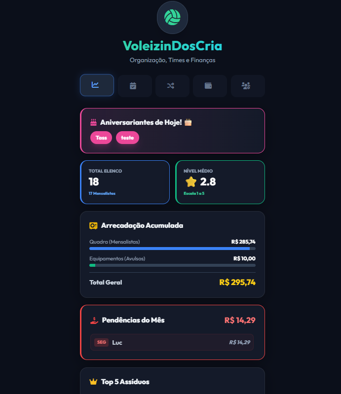

# <p align="center">🏐 VoleizinDosCria 🏐</p>

<p align="center">
  
  
  
  
  
</p>

<p align="center">
  <strong>O sistema definitivo para gestão de grupos de vôlei amador.</strong><br />
  Uma aplicação Web moderna que transforma o Google Sheets em um Dashboard inteligente, organizado e automatizado para todos os dias da semana.
</p>

<p align="center">
  
</p>

> **Nota:** Interface real do Web App rodando via Google Apps Script. Siga o guia de instalação abaixo para configurar seu próprio painel.

---

## 🌟 Visão Geral

O **VoleizinDosCria** foi minuciosamente desenvolvido para resolver o caos e as dores de cabeça da organização de vôlei amador: listas de presença infinitas no WhatsApp, cálculos de rateio complexos e manuais, além da montagem de times recorrentemente desequilibrados. Com uma interface **Glassmorphism**, um backend robusto em GAS e suporte a qualquer dia da semana, ele centraliza exatamente tudo o que um administrador de vôlei precisa em um único lugar, num formato "App-Like" responsivo para celulares e desktops.

---

## 🚀 Funcionalidades de Elite

### 📊 Dashboard Analítico (Business Intelligence)
*   **Visão Geral do Elenco:** Acompanhe o total de jogadores, separados entre todas as categorias.
*   **Saúde Financeira:** Monitore a arrecadação acumulada e visualize as proporções destinadas à quadra e aos avulsos (caixa de bola).
*   **Ranking de Assiduidade:** Top 5 presenças para incentivar a regularidade do grupo.
*   **Equilíbrio Técnico:** Gráficos e painéis indicando a distribuição de força do grupo por níveis (1 a 5 ⭐).

### 📅 Chamada Inteligente e Dinâmica
*   **Aba Presença Multi-Dia:** Reconhecimento automático de todos os dias cadastrados da semana. O app sabe exatamente qual será o próximo dia de treino.
*   **Status em Tempo Real:** Confirmações de jogo dinâmicas ("Vou" ou "Falto") com recálculo instantâneo de presenças.
*   **Trava Financeira em Tempo Real:** Jogadores na modalidade **Avulso** só podem clicar em "Vou" após a confirmação em sistema de que receberam e atestaram o seu pix/dinheiro da diária (R$10).

### 🔀 Algoritmo de Sorteio Balanceado (Snake Draft)
*   **Fair Play Garantido:** Distribuição de jogadores pautada puramente pela somatória dos níveis técnicos, equilibrando o peso (Lvl Total) de cada equipe formada na grade.
*   **Zap Sync Instantâneo:** Gere os times otimizados e encaminhe a formatação textual no WhatsApp com apenas um toque no botão, economizando muito tempo.

### 💰 Inteligência Financeira e Regras de Negócio
1. **Rateio de Mensalistas:** O valor integral do custo da quadra determinado nos fechamentos é rateado dinamicamente pelos mensalistas vinculados a cada dia de treino (Ex: Rateio Terça, Rateio Sexta)
2. **Fundo de Equipamentos e Bola:** A verba levantada pelos **Avulsos** vai diretamente para um bloco separado de caixa focado em benefícios futuros.
3. **Gestão Pró-Ativa:** Listagem automática dos "Devedores" do mês com links diretos de cobrança para o WhatsApp individual de suas respectívas pendências.

---

## 🔒 Privacidade e Segurança Embutida

*   **Mascaramento de Dados:** Dados sensíveis, como os Telefones dos jogadores da plataforma, são mascarados automaticamente e com segurança nativa de string na visualização.
*   **Manutenção Controlada:** Operações de leitura, cálculo de saldo, rateio sob demanda e registros sem risco de corromper o banco na nuvem (Google Sheets).

---

## 📂 Estrutura do Projeto

```text
├── codigo.gs          # Backend (Lógica de API hospedada pelo Google Apps Script)
├── index.html         # Frontend (Template reativo em Vue 3.js + TailwindCSS)
├── demo_voleizin.webp # Captura animada demonstrativa da versão Web do sistema
├── README.md          # Documentação do projeto principal (Visão Geral)
└── INSTRUCOES.md      # Tabela com as instruções mais aprofundadas sobre como fazer o Deploy
```

---

## 🛠️ Guia Rápido de Instalação

Quer colocar esse sistema totalmente gratuito e robusto nas nuvens pelo Google?

1. Acesse **[Google Sheets / Planilhas Google](https://sheets.new)** e crie ou logue em uma planilha.
2. Na barra do topo, acesse **Extensões > Apps Script**.
3. Crie (ou selecione os existentes) os arquivos `codigo.gs` e `index.html` e cole o código neles de acordo com sua cópia.
4. Execute `setupInicial()` manualmente no editor 1 vez para arquitetar e gerar a base nas abas da sua planilha. Aceite os termos de consentimento que vão aparecer num pop-up.
5. No fim das contas, siga em tela para **Implantar > Nova Implantação**. Selecione que será do tipo **"App da Web"**, e em "Quem pode acessar", garanta que escolheu **Qualquer pessoa**. A URL gerada final é seu aplicativo.

Veja com mais calma e ilustrado como fazer esse pass-a-passo no [INSTRUCOES.md](./INSTRUCOES.md).

---

## 🎨 Interface & UX Responsiva
Buscando oferecer a melhor sensação possível, o App baseia-se numa estética **Dark Mode** rica em nuances com painéis no modelo "Glass", exibindo destaques pontuais baseados em cores (*Emerald, Cyan, Purple, Amber e Rose*). Funciona incrivelmente bem nas visualizações limitadas de Mobile (PWA nativo de fábrica com suporte a Full Screen da Home) até o layout largo proporcionado por Telas Desktops ou Notebooks em grade.

---

## ☕ Apoie o Desenvolvedor

O VoleizinDosCria é **100% gratuito e open source**. Se ele te ajudou a organizar o racha e você quiser retribuir com um cafezinho, vai ser muito bem-vindo! ❤️

<p align="center">
  <a href="https://www.buymeacoffee.com/hectornetf" target="_blank">
    
  </a>
  &nbsp;&nbsp;
  <a href="https://ko-fi.com/hectornetf" target="_blank">
    
  </a>
</p>

---

<p align="center">
  <i>Desenvolvido com ❤️ e voleibol na veia, focando na união de gerenciamento esportivo em nuvem. </i>
</p>
