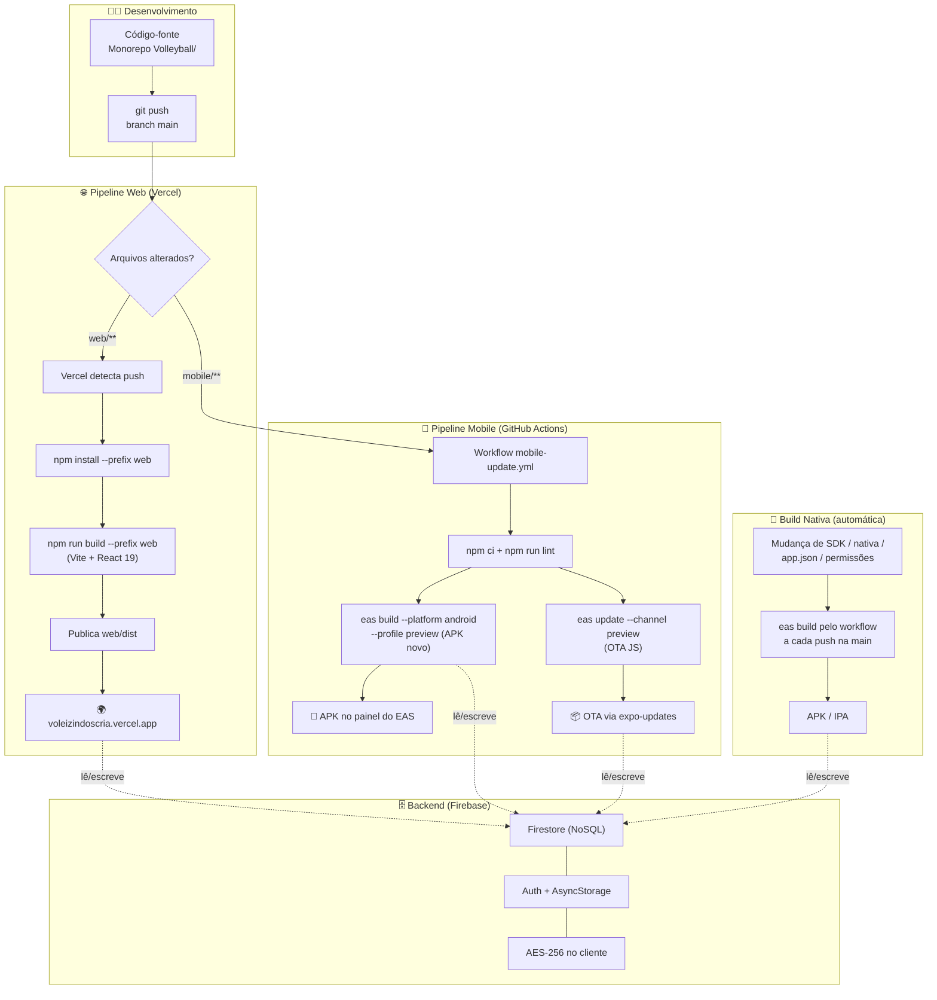

# <p align="center">🏐 VoleizinDosCria — Multi-Platform 🏐</p>

<p align="center">
  
  
  
  
  
  
</p>

<p align="center">
  <strong>Plataforma Multiplataforma (Mobile App + Web App) para Gestão de Grupos de Vôlei Amador.</strong><br />
  Presença em tempo real por dia da semana, sorteio equilibrado de times por nível com placar por confronto, painel de estatísticas por atleta, rateios financeiros e caixa de equipamentos com criptografia AES-256.
</p>

---

## 🌟 Estrutura da Plataforma

O repositório está organizado em duas aplicações principais sincronizadas em tempo real via **Firebase Cloud Firestore**:

```text
Volleyball/
├── mobile/            # App Mobile (React Native + Expo + NativeWind)
│   ├── src/           # Componentes, Telas, Contexto e Serviços
│   ├── firestore.rules# Regras de segurança do Firestore (Multi-Tenancy)
│   ├── app.json       # Config do Expo (versão do app sincronizada)
│   ├── INSTRUCOES.md  # Guia técnico e build de APK/IPA (EAS)
│   └── README.md      # Documentação do projeto Mobile
│
├── web/               # App Web (Vite + React 19 + Tailwind CSS)
│   ├── src/           # Componentes, Páginas, Contexto e Serviços
│   ├── INSTRUCOES.md  # Guia de execução e deploy Web
│   └── README.md      # Documentação do projeto Web
│
├── scripts/           # Automação: verify.js + bump-version.js
├── .githooks/         # Hooks Git (pré-commit: verificação + bump de versão)
├── codigo.gs          # Versão Legada (Google Apps Script)
├── index.html         # Versão Legada (Vue 3 + GAS)
└── README.md          # Documentação Principal da Plataforma
```

---

## 🚀 Principais Módulos da Plataforma

1. **📱 App Mobile ([`mobile/`](./mobile))**:
  - Desenvolvido em **React Native + Expo SDK 57**.
   - Notificações, suporte a gestos e build nativo Android/iOS via EAS Build.
  - Atualizações JavaScript distribuídas por EAS Update no canal `preview`.
   - Sincronização em tempo real do código do grupo (`VO-XXXX`).

2. **🌐 App Web ([`web/`](./web))**:
   - Desenvolvido em **Vite + React + Tailwind CSS**.
   - Interface Single-Page (SPA) rápida e 100% responsiva para desktop e navegador mobile.
  - Deploy contínuo na Vercel: [voleizindoscria.vercel.app](https://voleizindoscria.vercel.app/).
  - Funcionalidades compartilhadas com o aplicativo mobile via Firestore.

3. **🏐 Sorteio com Placar por Confronto**:
   - Rodadas concluídas registram o placar de **todos contra todos** (coleção `sorteios_times`, campo `confrontos`), com 2 ou 3 times por rodada.
   - Balanceamento que evita **duplas/trios repetidos** e sinaliza atletas com **histórico insuficiente** (menos de 8 jogos).

4. **📊 Painel do Atleta**:
   - Dashboard (Web e Mobile) com partidas, aproveitamento, presença, força e evolução por atleta.

5. **🧪 Ferramentas de Teste (Admin)**:
   - **Gerar Amostra Completa de Teste PRO**: elenco, 12 rodadas concluídas, rodada aberta do dia, presenças, finanças e configuração do mês.
   - **Resetar Todos os Dados do Grupo**: limpa em lotes jogadores, rodadas, finanças e configurações (inclui legados de ±2 meses).

## 🚀 Publicação

- **Web:** cada push na branch `main` atualiza o deploy da Vercel.
- **Mobile:** o workflow `mobile-update.yml` gera **automaticamente um novo APK** (build `preview`) e publica o **OTA** no canal `preview` a cada push na `main`.
- **Mobile nativo:** mudanças de SDK, dependências nativas ou configuração também são incluídas na build automática a cada push.

Consulte os guias específicos em [`mobile/INSTRUCOES.md`](./mobile/INSTRUCOES.md) e [`web/INSTRUCOES.md`](./web/INSTRUCOES.md).

---

## 🧭 Arquitetura de Deploy Automatizado

A plataforma usa **CI/CD contínuo** com dois pipelines independentes, acionados por push na branch `main`:


```mermaid
flowchart TB
    subgraph DEV["👨‍💻 Desenvolvimento"]
        A["Código-fonte<br/>Monorepo Volleyball/"]
        A --> B["git push<br/>branch main"]
    end

    B --> C{"Arquivos alterados?"}

    subgraph WEB["🌐 Pipeline Web (Vercel)"]
        C -- "web/**" --> D["Vercel detecta push"]
        D --> E["npm install --prefix web"]
        E --> F["npm run build --prefix web<br/>(Vite + React 19)"]
        F --> G["Publica web/dist"]
        G --> H["🌍 voleizindoscria.vercel.app"]
    end

    subgraph MOBILE["📱 Pipeline Mobile (GitHub Actions)"]
        C -- "mobile/**" --> I["Workflow mobile-update.yml"]
        I --> J["npm ci + npm run lint"]
        J --> K["eas build --platform android<br/>--profile preview (APK novo)"]
        J --> K2["eas update --channel preview<br/>(OTA JS)"]
        K --> L["📲 APK no painel do EAS"]
        K2 --> M2["📦 OTA via expo-updates"]
    end

    subgraph NATIVE["🔧 Build Nativa (automática)"]
        M["Mudança de SDK / nativa /<br/>app.json / permissões"]
        M --> N["eas build pelo workflow<br/>a cada push na main"]
        N --> O["APK / IPA"]
    end

    subgraph DATA["🗄️ Backend (Firebase)"]
        P["Firestore (NoSQL)"]
        Q["Auth + AsyncStorage"]
        R["AES-256 no cliente"]
    end

    H -. "lê/escreve" .-> P
    K -. "lê/escreve" .-> P
    M2 -. "lê/escreve" .-> P
    O -. "lê/escreve" .-> P
    P --- Q --- R
```

### Fluxo resumido

| Gatilho | Pipeline | Resultado |
|---|---|---|
| Push `main` com mudanças em `web/**` | Vercel (via `vercel.json`) | Deploy automático da SPA |
| Push `main` com mudanças em `mobile/**` | GitHub Actions (`mobile-update.yml`) | **APK novo** (`eas build preview`) + **OTA** (`eas update`) no canal `preview` |

> **Regra de ouro:** a build automática cobre qualquer mudança (JS, SDK, nativa, permissões, `app.json`). O OTA (EAS Update) continua disponível para updates de JavaScript em builds já instaladas com runtime compatível.

---

## 🧹 Código Limpo e Qualidade

- **Verificação obrigatória no pré-commit**: o hook `.githooks/pre-commit` roda `scripts/verify.js` e **bloqueia o commit** se algo falhar — lint Web (ESLint), build Web (Vite), lint Mobile (ESLint) e auditoria de dependências (`critical`/`high`).
- **Detecção de segredos no pré-commit**: o `verify.js` varre o diff staged e bloqueia vazamento de `.env`, chaves privadas (`.pem`/`.key`) e credenciais Firebase.
- **Lint obrigatório no CI**: o workflow `mobile-update.yml` executa `npm run lint` (ESLint) antes de publicar qualquer OTA — código com erro não vai para produção.
- **Padrão de pastas consistente**: `screens/`, `components/`, `services/`, `context/`, `config/`, `utils/` espelhados entre `mobile/` e `web/`.
- **Serviços desacoplados**: toda comunicação com o Firestore fica isolada em `services/` (`jogadorService`, `sessionService`, `historyService`), mantendo as telas limpas.
- **Contexto global**: `SessionContext` centraliza o `activeGroupId` e o estado de carregamento, evitando prop-drilling.
- **Criptografia centralizada**: `utils/crypto.js` encapsula AES-256, usado por todos os serviços.

---

## 🏷️ Versionamento Automático

Cada commit incrementa automaticamente o número de versão (patch: `1.0.0 → 1.0.1`):

- O hook `.githooks/pre-commit` executa `scripts/bump-version.js` **antes** de rodar as verificações.
- A versão é sincronizada em **Web** (`web/package.json` + lockfile) e **Mobile** (`mobile/package.json` + lockfile + `mobile/app.json`).
- A versão atual aparece na interface: **badge `vX.Y.Z` no Navbar Web** e **texto `vX.Y.Z` no Dashboard Mobile**.
- Bumps manuais para `minor`/`major`: `node scripts/bump-version.js minor` (ou `major`).

---

## 🔒 Segurança e Multi-Tenancy

- **Multi-Tenancy por Código (`VO-XXXX`)**: Cada grupo gerencia seus atletas e caixa com um código isolado.
- **Criptografia AES-256 no Cliente**: Dados sensíveis (nomes, telefones, datas de nascimento, lançamentos) criptografados com a chave secreta do grupo.
- **Auditoria de Histórico**: Feed de logs gravados no Firestore para acompanhamento de pagamentos e presenças.
- **Regras do Firestore** (`firestore.rules`): toda query exige o filtro `groupId`, garantindo isolamento entre grupos.
- **Segredos fora do código**: credenciais via `.env` (`EXPO_PUBLIC_*` / `VITE_*`) e `EXPO_TOKEN` como secret do GitHub — nunca versionados.

---

## ☕ Apoie o Desenvolvedor

O VoleizinDosCria é **100% gratuito e open source**. Se ele te ajudou a organizar o racha, pague um café pro dev! ❤️

<p align="center">
  <a href="https://www.buymeacoffee.com/hectornetf" target="_blank">
    
  </a>
  &nbsp;&nbsp;
  <a href="https://ko-fi.com/hectornet" target="_blank">
    
  </a>
</p>

---

<p align="center">
  <i>Desenvolvido com ❤️ e voleibol na veia.</i>
</p>
