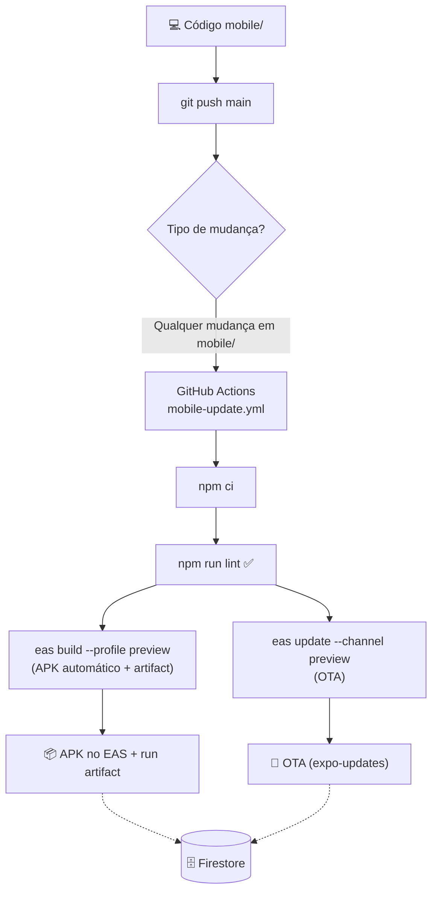

# 📋 Guia Técnico de Desenvolvimento — VoleizinDosCria Platform

Este documento define a arquitetura, regras de negócio e padrões de segurança para a plataforma **VoleizinDosCria** (SaaS Multi-Tenancy).

---

## 🏗️ Arquitetura do Sistema

A plataforma utiliza uma arquitetura **SaaS (Software as a Service)** moderna:
- **Frontend**: React Native with Expo SDK 57 (Managed Workflow).
- **Backend**: Firebase Firestore (NoSQL) com isolamento por Grupo.
- **Segurança**: Criptografia AES-256 (Camada de Aplicação).
- **Styling**: NativeWind (Tailwind CSS para Mobile).

---

## 🛠️ Passo a Passo: Configuração Inicial

Para rodar este projeto pela primeira vez, siga estas etapas:

### 1. Criar Projeto no Firebase
1. Vá ao [Firebase Console](https://console.firebase.google.com/) e clique em **Adicionar Projeto**.
2. No menu lateral, clique em **Build > Cloud Firestore** e clique em **Criar banco de dados**.
3. Em **Regras de Segurança**, use o conteúdo do arquivo `firestore.rules` que está na raiz desta pasta mobile.

### 2. Registrar o App (Obter Credenciais)
1. No console do Firebase, clique no ícone de **Web (</>)** para adicionar um app.
2. Copie o objeto `firebaseConfig` que aparecerá. Você usará esses valores no seu `.env`.

### 3. Configurar Variáveis de Ambiente (.env)
Crie um arquivo chamado `.env` na raiz da pasta `mobile/`:

```env
# Configurações do Firebase
EXPO_PUBLIC_FIREBASE_API_KEY=...
EXPO_PUBLIC_FIREBASE_AUTH_DOMAIN=...
EXPO_PUBLIC_FIREBASE_PROJECT_ID=...
EXPO_PUBLIC_FIREBASE_STORAGE_BUCKET=...
EXPO_PUBLIC_FIREBASE_MESSAGING_SENDER_ID=...
EXPO_PUBLIC_FIREBASE_APP_ID=...
EXPO_PUBLIC_FIREBASE_MEASUREMENT_ID=...

# Chave de Criptografia (Mantenha em segredo!)
EXPO_PUBLIC_ENCRYPTION_KEY=sua_chave_aqui
```

### 4. Índices do Firestore (Obrigatório)
Para que a aba de **Histórico** funcione, crie o índice composto no console:
- **Coleção**: `logs_atividades`
- **Campos**: `groupId` (Ascending) + `createdAt` (Descending)

---

## 🛡️ Regras de Ouro (Segurança e Privacidade)

### 1. Criptografia AES-256
Dados sensíveis dos jogadores **devem** ser criptografados.
- **Campos Encriptados**: `nome`, `celular`, `dataNascimento` (na col. jogadores) e `descricao` (nas finanças).

### 2. Isolamento Multi-Tenancy
Nenhuma query deve ser feita sem o filtro de `groupId`. O `SessionContext` provê o `activeGroupId` globalmente.

---

## 📊 Estrutura do Banco de Dados (Firestore)

### Coleção `jogadores`
| Campo | Tipo | Descrição |
|---|---|---|
| `nome` | String (AES) | Nome do jogador |
| `groupId` | String | ID do grupo (Ex: VO-XXXX) |
| `tipo` | String | `MENSALISTA` ou `AVULSO` |
| `status` | String | `Ativo` ou `Inativo` (Filtra presenças) |

### Coleção `operacoes_financeiras`
| Campo | Tipo | Descrição |
|---|---|---|
| `tipo` | String | `ENTRADA_AVULSO`, `SAIDA_DESPESA`, etc. |
| `valor` | Number | Valor da operação |
| `groupId` | String | Vínculo com o grupo |

### Coleção `logs_atividades` (Novo)
| Campo | Tipo | Descrição |
|---|---|---|
| `categoria` | String | `FINANCEIRO`, `CADASTRO`, `PRESENÇA`, `SISTEMA` |
| `descricao` | String | Texto amigável da ação |
| `createdAt` | Timestamp | Data/Hora para ordenação oficial |
| `groupId` | String | Vínculo com o grupo |

### Coleção `config_financeira` (Novo)
| Campo | Tipo | Descrição |
|---|---|---|
| ID Documento | String | Formato: `{groupId}_{Mês}` (Ex: VO-123_Janeiro 2026) |
| `Segunda..Domingo` | Number | Custo fixo da quadra por dia da semana |
| `Avulso` | Number | Valor padrão da diária |

---

## 📦 Como Gerar APK (Android) e IPA (iOS)

Para gerar os arquivos de instalação final, utilizamos o **EAS Build**.

### 1. Login
```bash
npx eas-cli login
```

### 2. Configuração do Projeto
Execute na pasta `mobile/`:
```bash
npx eas-cli@latest project:info
```

### 3. Comandos de Geração
- **Android (APK de Teste)**: `npx eas-cli build --platform android --profile preview`
- **Android (Play Store)**: `npx eas-cli build --platform android --profile production`
- **iOS (IPA)**: `npx eas-cli build --platform ios` (Requer conta Apple Developer)

> **Build automático:** o workflow `.github/workflows/mobile-update.yml` já gera o APK `preview` automaticamente a cada push na branch `main` — os comandos acima são apenas para builds manuais ou de outros perfis.

O projeto EAS atual é `@hectornetf/voleizin-dos-cria`. O perfil `preview` usa o canal `preview` e gera uma build para distribuição interna.

### Variáveis obrigatórias no build remoto

O arquivo `.env` é usado apenas na sua máquina e é ignorado pelo Git. Antes de gerar um APK pelo EAS, cadastre as oito variáveis `EXPO_PUBLIC_...` mostradas na seção de configuração inicial no painel **Expo > Project settings > Environment variables**, nos ambientes `preview` e `production` (e em `development`, se aplicável).

O workflow de atualização OTA usa o ambiente `preview` do próprio Expo. Assim, ele recebe as mesmas variáveis que foram usadas para gerar o APK, sem precisar duplicá-las no GitHub.

Depois de cadastrá-las, faça uma nova build `preview`, instale o novo APK e publique uma OTA somente após conferir que o workflow concluiu sem erro.

### 4. Atualizações automáticas (Build + EAS Update)

O workflow `.github/workflows/mobile-update.yml` roda a cada push na branch `main` com alterações em `mobile/` e:

1. Instala dependências e roda `npm run lint` (falha bloqueia a publicação).
2. Executa **`eas build --platform android --profile preview`** — gerando um **APK novo automaticamente** e o guarda como **artifact do run** (`voleizin-preview-apk`).
3. Publica o **`eas update --channel preview`** (OTA do JavaScript) usando o secret `EXPO_TOKEN` do GitHub.

Builds OTA não exigem instalar um APK novo, mas o OTA só é aplicado em builds com runtimeVersion compatível.

---

## 🚀 Comandos Úteis
- `npm install`: Instala dependências.
- `npx expo start -c`: Inicia o app limpando o cache.
- `npm run lint`: Verifica qualidade do código.
- `npx -y expo-doctor`: Verifica dependências e configuração do Expo.

---

## 🔄 Fluxo de Deploy Automatizado



> **Regra de ouro:** o workflow gera um APK novo a cada push na `main`. O OTA continua disponível para builds já instaladas com runtime compatível.

## 🧹 Código Limpo & 🔒 Segurança

- **Verificação no pré-commit**: o hook `.githooks/pre-commit` roda `scripts/verify.js` (lint Web, build Web, lint Mobile e auditoria `critical`/`high`) e bloqueia o commit em caso de falha.
- **Detecção de segredos**: o `verify.js` bloqueia vazamento de `.env`, chaves privadas e credenciais Firebase no diff staged.
- **Lint no CI**: `npm run lint` roda antes de publicar qualquer OTA — código com erro não vai para produção.
- **Estrutura organizada**: `screens/`, `components/`, `services/`, `context/`, `config/`, `utils/`.
- **Serviços desacoplados**: Firestore isolado em `services/` (`jogadorService`, `sessionService`, `historyService`).
- **Contexto global**: `SessionContext` centraliza `activeGroupId` e estado de carregamento.
- **AES-256 no cliente** via `utils/crypto.js` (nomes, telefones, datas, lançamentos).
- **Multi-Tenancy**: toda query exige `groupId` (`firestore.rules`).
- **Segredos no `.env`** (`EXPO_PUBLIC_*`) e `EXPO_TOKEN` como secret do GitHub — nunca versionados.

---

## 🏷️ Versionamento Automático

- A versão é lida do `mobile/app.json` e exibida no header do **Dashboard** (`vX.Y.Z`).
- A cada commit, o hook `.githooks/pre-commit` roda `scripts/bump-version.js` e incrementa automaticamente o **patch** (`1.0.0 → 1.0.1`), sincronizando `mobile/package.json`, `mobile/package-lock.json` e `mobile/app.json`.
- Bump manual de `minor`/`major`: `node ../scripts/bump-version.js minor` (ou `major`) na raiz do repositório.
- **Compatibilidade OTA**: o `runtimeVersion.policy` é `appVersion` — alterar `minor`/`major` no `app.json` sinaliza uma mudança que requer nova build EAS; `patch` é compatível com OTA.

> Propriedade de **VoleizinDosCria Team**.
