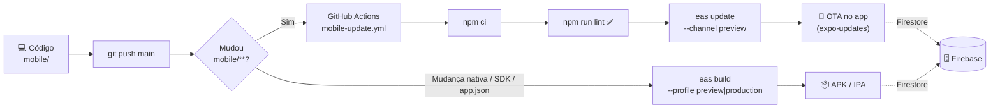

# 🏐 VoleizinDosCria — SaaS Platform (v2.1)

[](https://expo.dev/)
[](https://firebase.google.com/)

**VoleizinDosCria** é uma plataforma **SaaS (Software as a Service)** de alta performance para a gestão completa de grupos de vôlei, desenvolvida com **Expo SDK 57**.

---

## 🚀 Diferenciais da Plataforma

### 💎 Gestão SaaS e Auditoria
- **Histórico Completo**: Cada ação (pagamento, cadastro, presença) gera um log de auditoria em tempo real.
- **Isolamento de Dados**: Cada grupo possui seu próprio espaço seguro no banco de dados.

### 💰 Inteligência Financeira
- **Rateio Automático**: O sistema calcula o valor por pessoa dividindo o custo de cada dia apenas pelos mensalistas ativos cadastrados naquele dia. Dias sem custo não entram no rateio.
- **Fundo de Equipamentos**: Gestão separada para compra de bolas e materiais.

### 🐍 Sorteio Balanceado (Snake Draft)
- **Equilíbrio Técnico**: Algoritmo que distribui jogadores de elite e iniciantes de forma alternada para garantir jogos competitivos.

---

## 📦 Setup Rápido

1. `npm install`
2. Configure o `.env` (veja `INSTRUCOES.md`)
3. `npx expo start -c`

Para testar no celular, use o Expo Go compatível com SDK 57 ou gere uma build própria. O projeto está vinculado ao EAS como `@hectornetf/voleizin-dos-cria`.

## Atualizações e builds

- Pushes na `main` que alteram `mobile/` publicam EAS Update automaticamente no canal `preview`.
- A instalação inicial deve ser uma build EAS do perfil `preview`.
- Mudanças nativas exigem uma nova build Android ou iOS.

```bash
npx eas-cli@latest build --platform android --profile preview
```

---

## � Deploy Automatizado (CI/CD)



> **Regra:** OTA atualiza só o JavaScript. SDK, dependências nativas, permissões, ícone ou `app.json` exigem nova build.

---

## 🧹 Código Limpo

- **Lint no CI**: `npm run lint` (ESLint) roda antes de publicar qualquer OTA.
- **Estrutura organizada**: `screens/`, `components/`, `services/`, `context/`, `config/`, `utils/`.
- **Serviços desacoplados**: Firestore isolado em `services/` (`jogadorService`, `sessionService`, `historyService`).
- **Contexto global**: `SessionContext` centraliza `activeGroupId` e estado de carregamento.

## 🔒 Segurança

- **AES-256 no cliente** via `utils/crypto.js` (nomes, telefones, datas, lançamentos).
- **Multi-Tenancy**: toda query exige `groupId` (`firestore.rules`).
- **Segredos no `.env`** (`EXPO_PUBLIC_*`) e `EXPO_TOKEN` como secret do GitHub — nunca versionados.

---

## 🛠️ Stack
- React Native + Expo SDK 57
- Tailwind CSS (NativeWind)
- Firebase Firestore (v12) + AES-256 Crypto

> Projeto desenvolvido pela equipe **Antigravity**. 🏐🔥
