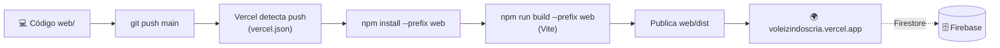

# 🌐 Guia Técnico — VoleizinDosCria Web Application

Este repositório contém a versão **Web** da plataforma **VoleizinDosCria**, desenvolvida em **React, Vite e Tailwind CSS**, totalmente sincronizada em tempo real com o aplicativo **Mobile (React Native/Expo)**.

---

## 🏗️ Arquitetura e Compatibilidade de Dados

- **Backend**: Firebase Cloud Firestore (NoSQL) compartilhado entre Web e Mobile.
- **Isolamento**: Multi-Tenancy por código de grupo (`groupId` no formato `VO-XXXX`).
- **Segurança**: Criptografia AES-256 no cliente (Camada de Aplicação) via `crypto-js`.
- **Coleções do Firestore**:
  - `jogadores`: Cadastro de mensalistas e avulsos.
  - `operacoes_financeiras`: Entradas, saídas e caixa de equipamentos.
  - `config_financeira`: Custos da quadra por dia da semana e valor avulso.
  - `sorteios_times`: Rodadas abertas e concluídas, com `confrontos` (placar todos contra todos), `times`, `reservas` e `diagnostico`.
  - `logs_atividades`: Feed de auditoria em tempo real.

---

## 🛠️ Como Executar a Aplicação Web

### 1. Instalar Dependências
Execute na pasta `web/`:

```bash
cd web
npm install
```

### 2. Rodar em Modo de Desenvolvimento
```bash
npm run dev
```
A aplicação abrirá no navegador em `http://localhost:3000`.

### 3. Gerar Build de Produção
```bash
npm run build
```
Os arquivos otimizados serão gerados na pasta `web/dist`, prontos para deploy no Firebase Hosting, Vercel ou Netlify.

### 4. Deploy automático na Vercel
O arquivo `vercel.json` na raiz do repositório configura a Vercel para construir a aplicação dentro de `web/`. Ao conectar o repositório GitHub à Vercel, cada push na branch `main` gera um novo deploy automaticamente.

No projeto Vercel, configure estas variáveis de ambiente para `Production` e `Preview`:

```env
VITE_FIREBASE_API_KEY=...
VITE_FIREBASE_AUTH_DOMAIN=...
VITE_FIREBASE_PROJECT_ID=...
VITE_FIREBASE_STORAGE_BUCKET=...
VITE_FIREBASE_MESSAGING_SENDER_ID=...
VITE_FIREBASE_APP_ID=...
VITE_FIREBASE_MEASUREMENT_ID=...
VITE_ENCRYPTION_KEY=...
```

Para usar o endereço `https://voleizindoscria.vercel.app/`, o projeto Vercel deve estar associado ao repositório `hectornetf/Volleyball` e esse domínio deve ser atribuído ao projeto em **Settings > Domains**.

---

## 🚀 Funcionalidades Incluídas na Web

1. **Acesso por Código (`VO-XXXX`)**: Compartilhado com o App Mobile.
2. **Dashboard**: Resumo geral, saldo do caixa, contagem de presenças e **Painel do Atleta** (partidas, aproveitamento, presença, força e evolução).
3. **Presença em Tempo Real**: Chamada rápida (Confirmado/Falta) e diária de avulsos.
4. **Sorteio de Times Equilibrados**: Algoritmo por nível (1 a 5) que evita duplas/trios repetidos, registra o **placar por confronto** (2 ou 3 times) e marca "histórico insuficiente" para quem tem menos de 8 jogos, com botão **Copiar para WhatsApp**.
5. **Financeiro & Rateios**: Cálculo automático de custo da quadra por dia da semana e caixa de equipamentos.
6. **Histórico**: Log de auditoria em tempo real.
7. **Admin de Jogadores**: Cadastro, edição de nível, ativação/desativação e ferramentas de simulação — **Gerar Amostra Completa de Teste PRO** (16 jogadores, 12 rodadas concluídas com placar por confronto, rodada aberta do dia, presenças, finanças e config) e **Resetar Todos os Dados** (limpa em lotes jogadores, rodadas, finanças e configurações).

---

## 🔄 Fluxo de Deploy Automatizado (Vercel)



> Cada push na branch `main` gera um novo deploy automaticamente. As variáveis `VITE_*` devem estar configuradas em **Production** e **Preview** no painel da Vercel.

## 🧹 Código Limpo & 🔒 Segurança

- **Verificação no pré-commit**: o hook `.githooks/pre-commit` roda `scripts/verify.js` (lint Web, build Web, lint Mobile e auditoria `critical`/`high`) e bloqueia o commit em caso de falha.
- **Detecção de segredos**: o `verify.js` bloqueia vazamento de `.env`, chaves privadas e credenciais Firebase no diff staged.
- **Estrutura organizada**: `pages/`, `components/`, `services/`, `context/`, `config/`, `utils/`.
- **Serviços desacoplados**: Firestore isolado em `services/` (`jogadorService`, `sessionService`, `historyService`).
- **AES-256 no cliente** via `utils/crypto.js` (nomes, telefones, datas, lançamentos).
- **Multi-Tenancy**: toda query exige `groupId` (`firestore.rules`).
- **Segredos no `.env`** (`VITE_*`) — nunca versionados.

## 🏷️ Versionamento Automático

- A versão é lida do `web/package.json` e exibida no **Navbar** (badge `vX.Y.Z` ao lado do "PRO WEB").
- A cada commit, o hook `.githooks/pre-commit` roda `scripts/bump-version.js` e incrementa automaticamente o **patch**, sincronizando `web/package.json` e `web/package-lock.json` com o Mobile.
- Bump manual de `minor`/`major`: `node scripts/bump-version.js minor` (ou `major`) na raiz do repositório.
